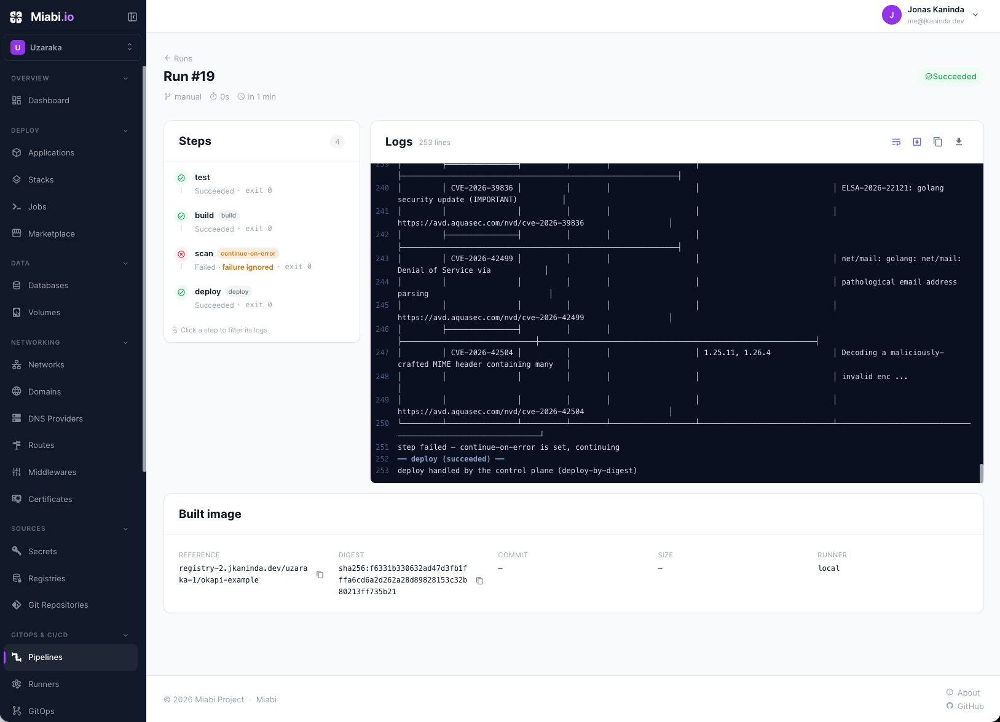

# miabi-runner

Machine-side runtime for Miabi's **dedicated build & pipeline execution**. A
runner is a build machine: it dials the Miabi control plane over an outbound,
NAT-friendly WebSocket, authenticates with its registration token, and appears
online — so builds and pipelines run here instead of on the app/database hosting
nodes. A hosting node then only ever *pulls* the resulting image, never builds it.

Unlike the [node agent](https://github.com/miabi-io/agent), a runner exposes **no
Docker socket** to the control plane — it uses its own local Docker/BuildKit
daemon. The tunnel exists so the control plane can lease build jobs to it and
stream logs/status back.


## Run

Register a runner in the Miabi UI (**Settings → Runners → Add runner**, or
**Admin → Runners** for a platform-shared one) to get a one-time token, then:

```sh
docker run -d --name miabi-runner \
  -e MIABI_CONTROL_URL=https://panel.example.com \
  -e MIABI_RUNNER_TOKEN=mbr_xxxxxxxx \
  -v /var/run/docker.sock:/var/run/docker.sock \
  -v /srv/miabi/builds:/srv/miabi/builds \
  -e MIABI_RUNNER_BUILDS_DIR=/srv/miabi/builds \
  miabi/runner:latest
```

The default `docker` backend builds and runs steps against a Docker daemon, so
the container needs the **host Docker socket** bind above (this is the runner's
*own* daemon — it is never exposed to the control plane). The builds-dir volume
is mounted at the same path inside and out so the per-step `-v` mounts resolve on
the host daemon (see `MIABI_RUNNER_BUILDS_DIR` below). Using the rootless
`buildkit` backend (`-e MIABI_RUNNER_BUILDER=buildkit`) needs neither.

Or as a binary: `MIABI_CONTROL_URL=… MIABI_RUNNER_TOKEN=… ./miabi-runner`.

### CI/CD pipelines in Miabi

<p align="center">
  
</p>

## Configuration (environment)

| Variable | Required | Meaning |
|---|---|---|
| `MIABI_CONTROL_URL` | yes | Control plane base URL (falls back to `MIABI_API_URL`) |
| `MIABI_RUNNER_TOKEN` | yes | Registration token issued when the runner was added (`mbr_…`) |
| `MIABI_RUNNER_INSECURE_SKIP_VERIFY` | no | Skip TLS verification of the control plane (dev only; default false) |
| `MIABI_RUNNER_BUILDER` | no | Build backend: `docker` (default; also runs container steps and **buildpack** builds) or `buildkit` (rootless/daemonless, Dockerfile-only, no docker.sock) |
| `MIABI_RUNNER_DEFAULT_BUILDER` | no | CNB builder image used for buildpack builds when the job supplies none (default `paketobuildpacks/builder-jammy-base`) |
| `MIABI_RUNNER_BUILDS_DIR` | no | Parent dir for per-job workspaces (checkout + build context). Default: OS temp dir. Prefer a real sized volume over `/tmp` (tmpfs/RAM or ephemeral overlay). **In a containerized docker-backend runner, mount a host volume here at the _same_ path** (e.g. `-v /srv/miabi/builds:/srv/miabi/builds -e MIABI_RUNNER_BUILDS_DIR=/srv/miabi/builds`) so container/buildpack step `-v` mounts resolve on the host daemon. |
| `MIABI_DEV_MODE` | no | Debug logging (default false) |

## Builds

A build step turns the checked-out source into an image and pushes it to the
job's registry. Two methods, selected by the control plane (or auto-detected — a
root `Dockerfile` → Dockerfile build, otherwise buildpacks):

- **Dockerfile** — `docker build` (docker backend) or rootless BuildKit.
- **Cloud Native Buildpacks** — the bundled [`pack`](https://buildpacks.io) CLI
  (`docker` backend only; buildpacks need a Docker daemon). The builder image and
  extra buildpacks/build-env come from the job.

The runner reports its OS/arch/version to the control plane on connect (used for
label/arch job scheduling). Licensed under Apache-2.0.
